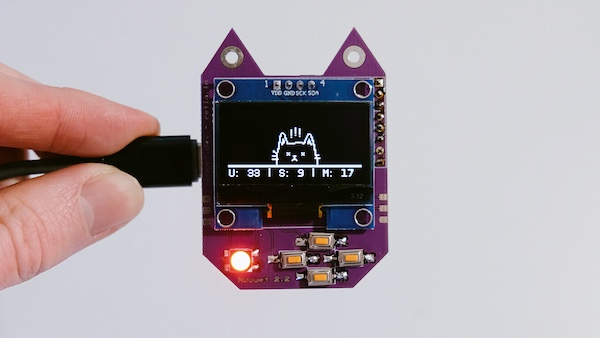

# Nugget BLE Spam Detector

  
   
  <b>Nugget BLE Detector</b>
   

Simple Bluetooth monitor + BLE spam detection.

Works on ESP32 S3 mini + Nugget dev board from Retia.

### How it works

The scanner runs in 10-second blocks and stores any BLE signal MAC addresses into a unique list.

If the next scan finds any of the same MAC addresses, they get stored in a safe list.

BLE spam attacks rely on MAC randomization. Therefore, we can assume that a flood of random MAC addresses appearing only once can trigger spam detection if we exceed the safe threshold (default is 17).

#### RSSI Signal

Added a simple RSSI signal strength capture when a spam attack is detected. Any suspicious packets are stored in a spamList and reduced to a group of similar strengths. The avg RSSI is then displayed on screen.

The idea being that you can walk around and see the signal strength get stronger when near a BLE spam attack device/source.

For example:

1. Power on Nugget (Press UP to start scanning).
2. 1st scan finds 10 unique devices.
3. 2nd scan finds the same 10 devices and stores them in the safe list.
4. Someone starts a BLE spam attack.
5. 3rd scan finds 30 unique devices.
6. UI displays spam detected graphic + NEO-pixel turns red.
7. 4th scan finds 25 more unique devices.
8. After 120 secs, scan is reset so that our seen list won't get overloaded in case of a spam attack.

### How to use

- Flash the program onto your ESP32 S3 mini board.

- Use the LEFT and RIGHT directional buttons to select BLE detection threshold (default is 17).

- Press the UP directional button to activate Bluetooth scanning.

- The Nugget will repeatedly scan for BLE signals nearby.

- If the number of unique devices quickly floods and exceeds the threshold, Nugget will display spam detected UI.

### Inspiration

This project has been adapted from - Bluetooth Crowd Monitor https://github.com/chandler767/Bluetooth-Crowd-Monitor

Get a Nugget Dev board here - https://retia.io/products/diy-s2-wifi-nugget-kit-unassembled?variant=40236998754382
